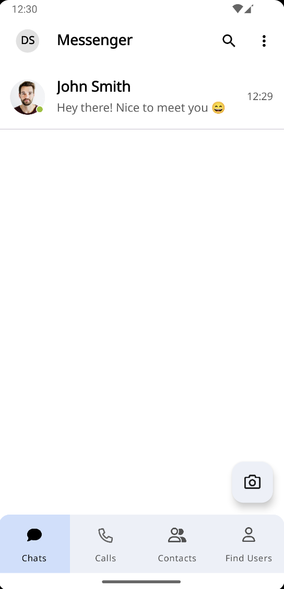
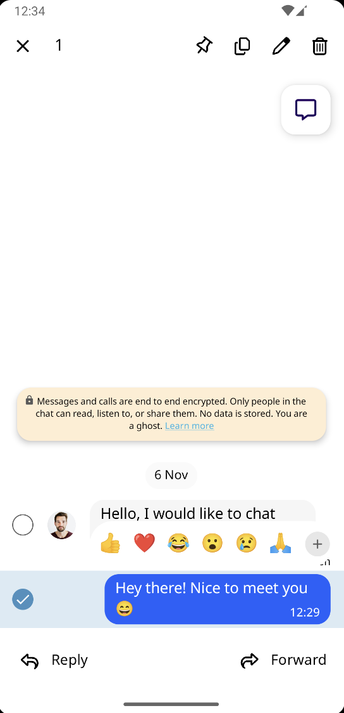
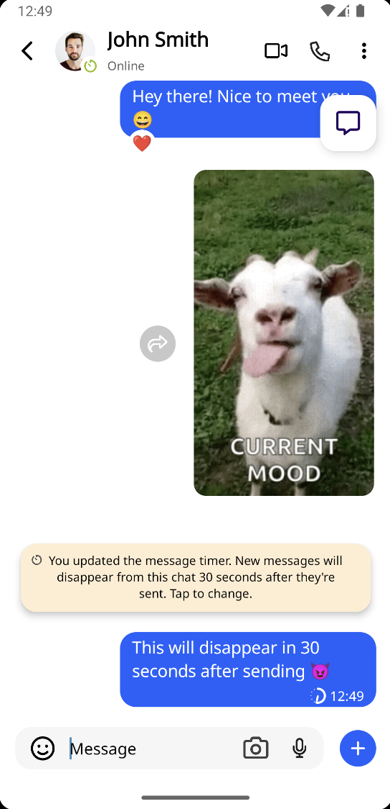
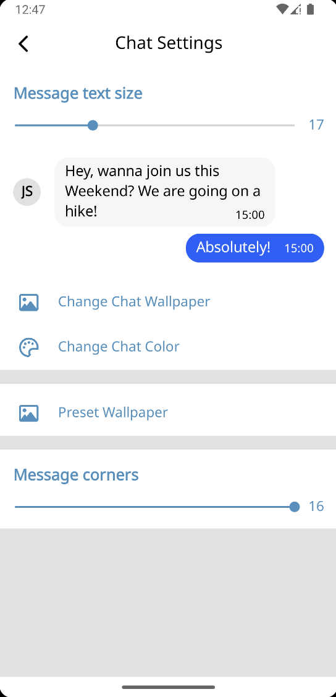
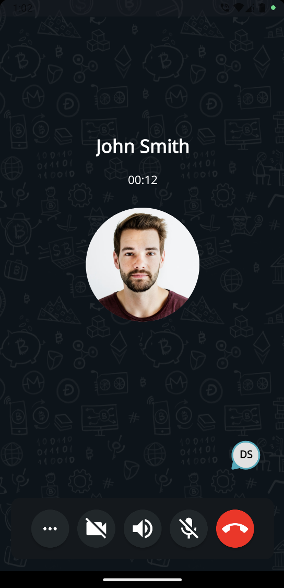

# Messenger
Open source Android Messenger App using Firebase supporting all modern chat app features 💬

## 🚀 Overview  
**Messenger** offers real-time messaging, user presence, rich media support, and a clean UI designed for seamless conversations with friends and colleagues.

## 📸 Screenshots by Feature

### 💬 Chat

  
  

### 💬 Chat Features

  
  
  
  

### 📸 Camera

  

### 💬⚙️ Chat Settings

  
  
  

### 📞 Call

  
  

### 📒 Contacts

  

## 🧱 Tech Stack  
- Language: Java + Kotlin
- Architecture: MVVM
- DI: Dagger Hilt
- Local Database: Room DB
- HTTP Requests: Retrofit + OkHttp
- Image Loading: Glide + Coil
- Camera: CameraX
- Backend: Firebase
- Remote Database: Firebase Firestore + Firebase RTDB
- Authentication: Firebase Auth
- Calls: Linphone SDK

## 🙋‍♂️ Contact
If you have any questions or want to report an issue, please open an issue on GitHub or reach out via email.
